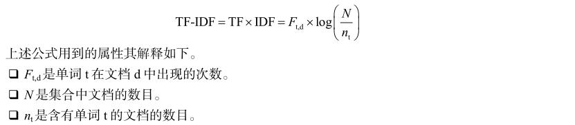

## 第一个例子：关键字抽取算法
关键字抽取算法的主要用途是从文本文档或者文档集合（内部对每个文档做了更好的定义）中抽取单词，这些术语可用于文档综述，文档的聚类分析，或者信息检索过程的提升。  

从文档集合的文档中抽取关键字最基本的算法是基于 `TF-IDF` 方法（而且该方法目前仍然被广泛使用），其中有如下两项。
-	**术语频次**（TF）是指一个单词在某个文档中出现的次数。  

-	**文档频次**（DF）是含有某个单词的文档的数量。  
**逆文档频次**（IDF）用于度量单词所提供的使某个文档区别于其他文档的信息。  
如果一个单词很常用，那么它的 IDF 值会很低，但是如果该单词仅在少数几个文档中出现，那么它的 IDF 值会很高。

在文档 d 中单词 t 的 `TF-IDF` 值可以通过下述公式计算。  
  

为获取文档的关键字，可以选用具有较高 TF-IDF 值的单词。  

要实现的算法将通过执行下述阶段计算文档集合中的最佳关键字。  
-	阶段 1 ：解析所有文档并且抽取所有单词的 DF 值。  
请注意，只有解析了所有文档才可以获得准确值。

-	阶段 2 ：计算所有文档中单词的 TF-IDF 值。  
为每个文档选择 10 个关键字（ TF-IDF 值评价最高的 10 个单词）。
-	阶段 3 ：获得一个最佳关键字列表。  
这个列表中的单词应该能够代表大多数文档的关键字。  

将实现本算法的两个版本：基础串行版本和使用 Phaser 类的并发版本。  
在此之后，我们将比较两个版本的执行时间，以验证并发处理能够带来更好的性能。  

### 公共类
该算法的两个版本具有一些通用功能，用于解析文档以及存储有关文档、关键字和单词的信息。  

-	[Document](common/Document.java) 类：  
用于存放含有文档以及构成文档的单词的文件名。

-	[Word](common/Word.java) 类：  
用于存放单词字符串和度量该单词的指标（ TF 、 DF 和 TF-IDF ）。
-	[Keyword](common/Keyword.java) 类：  
用于存放单词字符串以及将该单词作为关键字的文档数量。
-	[DocumentParser](common/DocumentParser.java) 类：  
用于抽取某个文档的单词。  

### 串行版本
-	[J2SerialKeywordExtraction](J2SerialKeywordExtraction.java) 类

### 并发版本
-	[KeywordExtractionTask](KeywordExtractionTask.java) 类：  
该类以并发方式实现准备计算关键字的任务。  
这些任务将作为 Thread 对象执行，因此该类实现了 Runnable 接口。

-	[J2ConcurrentKeywordExtraction](J2ConcurrentKeywordExtraction.java) 类：  
该类提供 main() 方法执行算法，创建、启动任务，并且等待任务完成。

使用 `ConcurrentHashMap` 是因为这些对象将被所有任务更新，这样就必须采用并发数据结构避免竞争条件。  
使用 `ConcurrentLinkedDeque` 类是因为所有任务都将同时抽取（获取或删除）该列表的元素，因此必须使用并发数据结构以避免竞争条件。  

