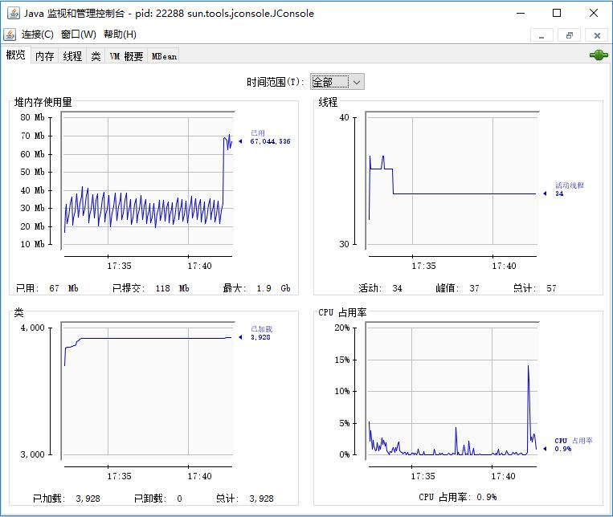

## 监视并发应用程序
JConsole 是图形化工具，展示了在 JVM 中执行的应用程序的信息。  

可以在 JDK 安装路径下的 bin 目录中找到它（jconsole.exe）。

有 6 个选项卡：
-	Overview：  
该选项卡展示了有关该应用程序的一般信息。

-	Memory：  
该选项卡展示了有关内存使用情况的信息。
-	Threads：  
该选项卡展示了应用程序的线程随时间推移的演变情况，而且允许查看某一线程的详细信息。
-	Classes：  
该选项卡展示了当前加载类的信息以及类的数量。
-	VM Summary：  
该选项卡展示了运行进程的 Java 虚拟机的信息。
-	MBean：  
该选项卡展示了进程的 MBean。  
Mbean 是一个托管的 Java 对象，可以表示设备、应用程序或者任何资源，而且它是 JMX API 的基础。

###	Overview 选项卡（概览）  
该选项卡以图形化方式展示了有关应用程序的一般信息，你可以看出不同时间取值的变化。  

这些信息包括如下几点。
-	Heap Memory Use：  
该图展示了应用程序使用的内存大小。它也展现了已用内存、指定内存和最大内存。
-	Threads：  
该图展示了应用程序所使用线程数的演变情况。其中含有程序员以显式方式创建的线程和由 JVM 所创建的线程。
-	Classes：  
该图展示了应用程序加载的类的数量。
-	CPU Usage：  
该图展示了应用程序 CPU 使用的变化情况。

###	Memory 选项卡（内存）  
该选项卡以图形化方式展示了应用程序的内存使用情况。你可以查看这些指标随时间的变化情况。
-	Used 区：  
展示应用程序当前的内存使用量。

-	Committed 区：  
用于保障 JVM 执行的内存量。
-	Max 区：  
JVM 可以使用的最大内存量。
-	GC time区：  
花费在垃圾收集上的时间。

###	Threads 选项卡（线程）  
在 Threads选项卡中，可以看到应用程序的线程随时间的变化情况。

###	Classes  选项卡（类）  
Classes 选项卡展示了当前加载类的信息。

###	VM Summary 选项卡（VM概要）  
VM Summary 选项卡展示了有关 Java 虚拟机的信息。

该选项卡展示了如下信息。
-	**摘要区域**：这一块区域展示了有关正在运行进程的 Java 虚拟机实现的信息。  
	-	`Virtual Machine`：正在执行进程的 Java 虚拟机的名称。  
	-	`Vendor`：实现该 Java 虚拟机的组织名称。  
	-	`Name`：运行进程的机器名称。   
	-	`Uptime`：从 JVM 启动到现在经过的时间。  
	-	`Process CPU time`：JVM 消耗的 CPU 时间。  
	
-	**线程区域**：该区域展示了有关应用程序线程的信息。  
	-	`Live threads`：当前运行的线程总数。  
	-	`Peak`：在 JVM 中执行的最高线程数。  
	-	`Daemon threads`：当前运行的守护线程总数。  
	-	`Total threads started`：自 JVM 开始运行后开始执行的线程总数。  
-	**类区域**：该区域展示了有关应用程序类的数量的信息。   
	-	`Current classes loaded`：当前加载到内存中的类的数量。  
	-	`Total classes loaded`：JVM 开始运行后加载到内存中的类的数量。  
	-	`Total classes unloaded`：JVM 开始运行后从内存中卸载的类的数量。  
-	**内存区**：该区域展示了应用程序的内存使用情况。  
	-	`Current heap size`：当前堆的规模。  
	-	`Committed memory`：为堆的使用分配的内存总量。  
	-	`Maximum heap size`：堆的最大规模。  
	-	`Garbage collector`：垃圾收集器的相关信息。  
-	**操作系统区**：该区域展示了有关执行 Java 虚拟机的操作系统的信息。  
	-	`Operating System`：运行 JVM 的操作系统的版本。  
	-	`Number of Processors`：计算机所配置的核的数量或 CPU 数量。  
	-	`Total physical memory`：操作系统可用的 RAM总量。  
	-	`Free physical memory`：操作系统可用的空闲 RAM 总量。  
	-	`Committed virtual memory`：保证当前进程运行的内存。  
-	**其他信息**：该区域展示了关于 Java 虚拟机的其他信息。    
	-	`VM arguments`：传递给 JVM 的参数。  
	-	`Class path`：JVM的类路径。  
	-	`Library path`：JVM 的库路径。  
	-	`Boot class path`：JVM 寻找 java.* 和 javax.* 类的路径。  

###	MBeans 选项卡（MBeans）  
MBeans 选项卡展示了所有在平台上注册的 MBean 的信息。  

在该选项卡的左侧，可以在目录树中看到所有正在运行的 MBean。  
选定其中一项，将在选项卡的右侧看到 MBean Info 和 MBean Descriptor 的内容。

并发应用程序可用 Threading MBean 表示，它共有两个区域。  
Attributes 区域包含 MBean 的属性，而 Operations 区域包含所有可以通过该 MBean 运行的操作。

###	About 选项卡（关于JConsole）
通过 Help 菜单中的 About 选项，可以获得当前执行的 JConsole 的版本信息。

